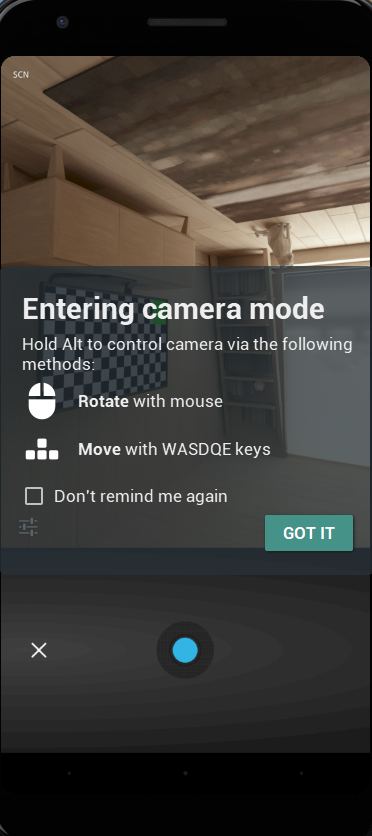
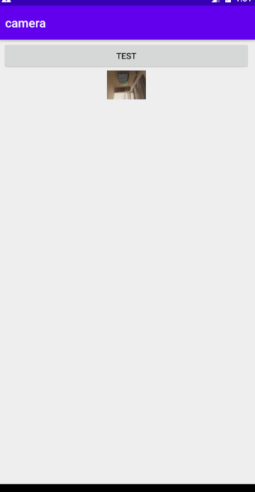

# 实验七 Android设备编程

## 一、实验目标


1.理解Android相机、蓝牙、传感器等设备编程方法；

2.理解Android设备编程与前面所学组件、存储、网络及界面开发的知识点关系。

## 二、实验内容


1.选择一个跟选题相关的设备功能；

（1）拍照显示、录视频；
（2）控制和检测网络；
（3）获取用户位置信息；
（4）判断屏幕方向并提示用户旋转手机（小游戏）；
（5）摇一摇手机。

2.编程实现设备使用。

## 三、实验步骤

1.建立PhotoActivity.xml文件

PhotoActivity.xml代码：

```xml
<?xml version="1.0" encoding="utf-8"?>
<androidx.constraintlayout.widget.ConstraintLayout xmlns:android="http://schemas.android.com/apk/res/android"
    xmlns:app="http://schemas.android.com/apk/res-auto"
    xmlns:tools="http://schemas.android.com/tools"
    android:layout_width="match_parent"
    android:layout_height="match_parent"
    tools:context=".MainActivity">

    <LinearLayout
        android:id="@+id/linear_layout"
        android:layout_width="409dp"
        android:layout_height="729dp"
        android:orientation="vertical"
        app:layout_constraintBottom_toBottomOf="parent"
        app:layout_constraintEnd_toEndOf="parent"
        app:layout_constraintStart_toStartOf="parent"
        app:layout_constraintTop_toTopOf="parent">

        <Button
            android:id="@+id/button_take_photo"
            android:layout_width="match_parent"
            android:layout_height="wrap_content"
            android:text="test" />
    </LinearLayout>
</androidx.constraintlayout.widget.ConstraintLayout>
```


2.建立PhotoActivity.java

PhotoActivity.java代码:

```java
package edu.hzuapps.androidlabs.examples;

/**
 * 拍照示例。
 * <p>
 * 需要在AndroidManifest.xml中添加设置：
 * <p>
 * <uses-feature android:name="android.hardware.camera" android:required="true" />
 */

import androidx.annotation.Nullable;
import androidx.appcompat.app.AppCompatActivity;

import android.content.Intent;
import android.graphics.Bitmap;
import android.os.Bundle;
import android.provider.MediaStore;
import android.view.View;
import android.widget.Button;
import android.widget.ImageView;
import android.widget.LinearLayout;

import edu.hzuapps.androidlabs.R;

public class PhotoActivity extends AppCompatActivity {

    private LinearLayout linearLayout;

    @Override
    protected void onCreate(Bundle savedInstanceState) {
        super.onCreate(savedInstanceState);
        setContentView(R.layout.activity_photo);

        // 准备界面
        linearLayout = findViewById(R.id.linear_layout);

        // 处理点击按钮
        ((Button) findViewById(R.id.button_take_photo)).setOnClickListener(new View.OnClickListener() {
            @Override
            public void onClick(View v) { // 请求拍照
                dispatchTakePictureIntent();
            }
        });
    }

    static final int REQUEST_IMAGE_CAPTURE = 1;

    // 请求拍照
    private void dispatchTakePictureIntent() {
        Intent takePictureIntent = new Intent(MediaStore.ACTION_IMAGE_CAPTURE);
        if (takePictureIntent.resolveActivity(getPackageManager()) != null) {
            startActivityForResult(takePictureIntent, REQUEST_IMAGE_CAPTURE);
        }
    }

    // 获取缩略图
    @Override
    protected void onActivityResult(int requestCode, int resultCode, @Nullable Intent data) {
        //super.onActivityResult(requestCode, resultCode, data);
        if (requestCode == REQUEST_IMAGE_CAPTURE && resultCode == RESULT_OK) {
            Bundle extras = data.getExtras();
            Bitmap imageBitmap = (Bitmap) extras.get("data");
            ImageView imageView = new ImageView(this);
            // TODO: 如何设置图片的大小？
            imageView.setImageBitmap(imageBitmap);
            linearLayout.addView(imageView);
        }
    }
}
```


## 四、运行结果及截图





## 五、实验心得

​		本次实验学习Android上的设备编程，自己的项目上没有用到本次实验的内容，通过调试课上的代码对本次实验设备编程有了一定的了解，本次实验实现摄像头拍照需要自己写一个xml文件才能实现，在设备编程上理解也花了很多的时间。

